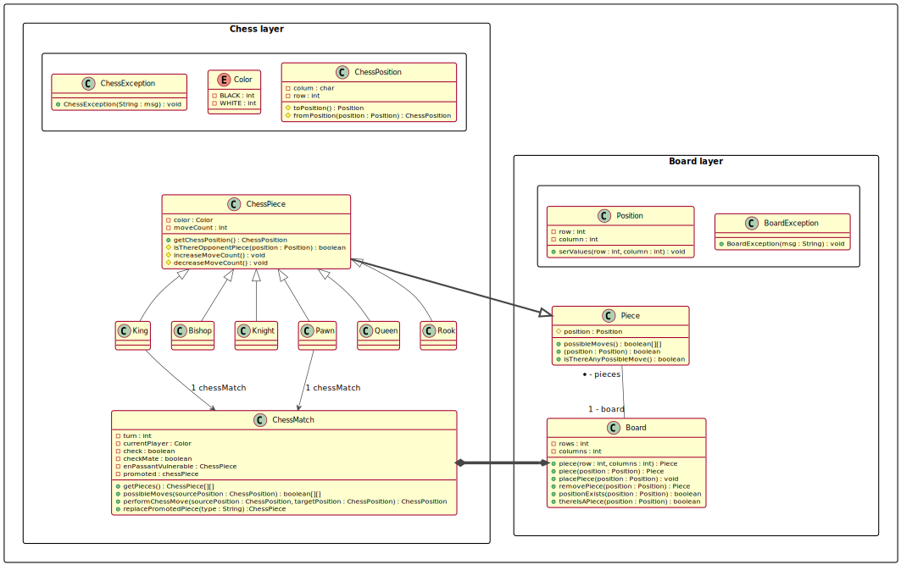

# chess-game

***

## Objective:
Create a chess game by applying the knowledge of overloading, constructor, encapsulation,
enumeration, composition, inheritance, polymorphism, upcasting, down-casting, overlay,
exception handling, among other topics.

## Technologies:
- [Jabba/Java v11](https://github.com/shyiko/jabba)
- UML
  - [PlantUML](https://plugins.jetbrains.com/plugin/7017-plantuml-integration)
  - [Graphviz](https://graphviz.org/)

***

## Class Diagram:

***[See the uml file here](chess-game.puml)***

***Tks: @acenelio***